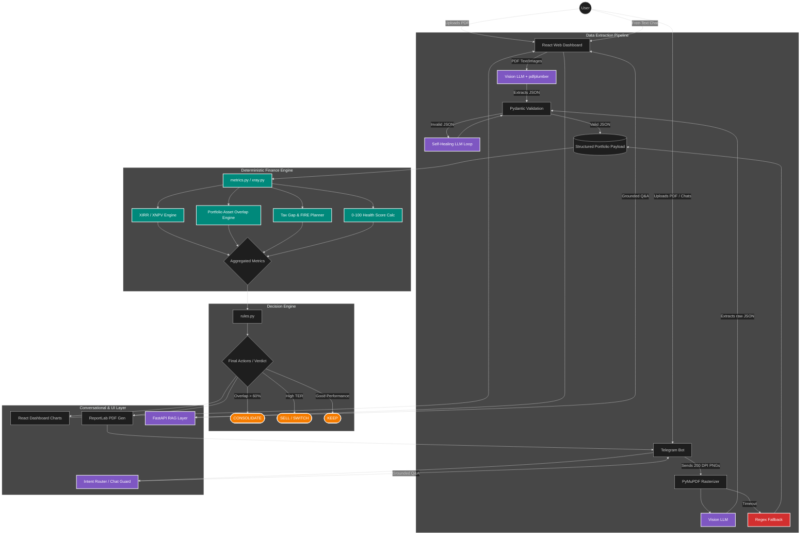

# Complete System Architecture (FinMentor AI & ArthaScan)

> [!IMPORTANT]
> This system is built on **"Zero-Hallucination Finance,"** isolating mathematical logic from generative AI to ensure 100% accurate financial advice.

---

## 🏗️ Unified Flow

---

## 🛠️ Component Breakdown (1-Page Summary)

### 1. Multi-Channel Extraction (Vision-First)
Standard text extraction often fails on complex statements. We use **Vision LLMs** to "read" document images:
*   **Web Dashboard:** Combines `pdfplumber` with Vision-capable LLMs for structural parsing.
*   **Telegram Bot:** Rasterizes PDFs to 200 DPI PNGs via `PyMuPDF` for high-accuracy image-to-JSON extraction.
*   **Error Handling:** Features a **Self-Healing Loop** (Pydantic re-prompts for JSON repairs) and **Regex Fallbacks** for resilient data capture.

### 2. Deterministic Financial Engine (The Sandbox)
AI is banned from calculations. A static Python engine processes the validated JSON payload:
*   **XIRR Engine:** Uses `XNPV` binary-search for true annualized returns.
*   **Duplication Engine:** Intersects fund holdings to find hidden asset overlap.
*   **Wealth Bleed:** Calculates 10-year fee erosion vs. index baselines.

### 3. Agent Roles & Decisions
*   **Extraction Agent:** Converts messy PDFs into structured "Financial Truth" dictionaries.
*   **Decision Engine:** A rigid heuristic tree (rules.py) that issues `SELL`, `SWITCH`, or `CONSOLIDATE` commands based on math—not probability.
*   **Presentation Agent:** Translates JSON findings into fluid conversational English/Hinglish (Chat Guards prevent hallucinations).

### 4. Tool Integrations
| Interface | Tech Stack | Primary Tools |
| :--- | :--- | :--- |
| **Backend** | FastAPI / Python | pyxirr, numpy, pydantic |
| **Frontend** | React 18 / Recharts | Animated ScoreRings, Heatmaps |
| **Bot** | Telegram Bot API | ReportLab (PDF Gen), Cache |

---

## 🛡️ Scalability & Production Note
The architecture is **model-agnostic**. Cloud-based Vision LLMs can be swapped for on-premise models (e.g., LLaVA) or secure enterprise OCR engines (e.g., Textract) to ensure data residency without altering the core deterministic engines.

View Mermaid Source Code

