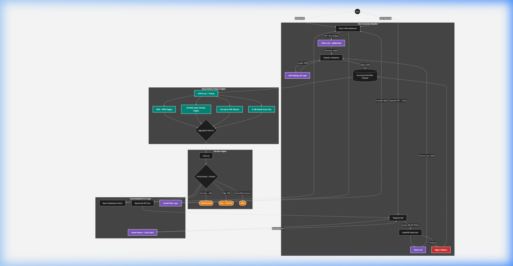
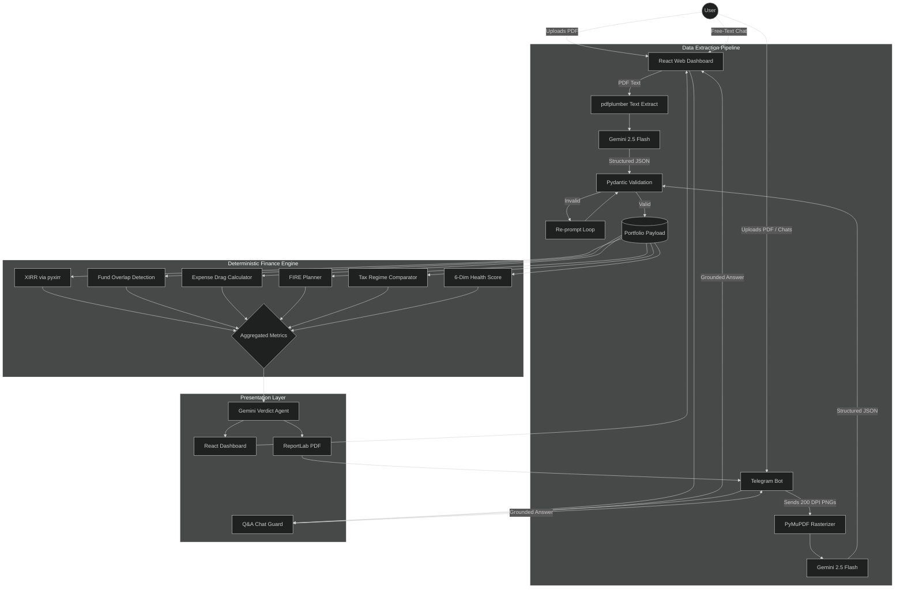

# Complete System Architecture (FinMentor AI & ArthaScan)

> [!IMPORTANT]
> This system is built on **"Zero-Hallucination Finance,"** isolating mathematical logic from generative AI to ensure 100% accurate financial calculations.

---

## Unified Flow

---

## Component Breakdown

### 1. Multi-Channel Extraction
Standard text extraction often fails on complex statements. We use LLMs for structured parsing:
*   **Web Dashboard:** `pdfplumber` extracts raw text, then **Gemini 2.5 Flash** converts it to validated JSON with strict schema prompting.
*   **Telegram Bot:** Rasterizes PDFs to 200 DPI PNGs via `PyMuPDF` for high-accuracy image-to-JSON extraction via Gemini.
*   **Error Handling:** Features Pydantic validation with re-prompts and regex fallbacks for resilient data capture.

### 2. Deterministic Financial Engine (The Sandbox)
AI is banned from calculations. A static Python engine processes the validated JSON payload:
*   **XIRR Engine:** Uses `pyxirr` for true annualized returns per-fund and portfolio-wide.
*   **Overlap Engine:** Pairwise fund overlap detection to reveal hidden duplicate exposure.
*   **Wealth Bleed Calculator:** 10-year expense ratio erosion vs index baselines.
*   **FIRE Planner:** Goal-based SIP allocation with inflation-adjusted corpus projections.
*   **Tax Wizard:** Old vs New regime comparison with deduction gap analysis (80C, 80D, NPS).

### 3. Agent Roles & Decisions
*   **Extraction Agent:** Converts messy PDFs into structured "Financial Truth" dictionaries.
*   **Verdict Agent:** Gemini generates a grounded verdict (scores, findings, actions) constrained by the deterministic metrics — it cannot invent numbers.
*   **Q&A Agent:** Chat Guard prevents hallucinations by grounding answers in the precomputed context object.

### 4. Frontend Architecture
*   **React 18 + Framer Motion:** Scroll-reveal animations, glassmorphic nav, animated number counters.
*   **Recharts:** Radar chart (Money Health Score), area charts (FIRE projection), bar charts (XIRR comparison).
*   **Interactive Tools:** What-If Life Event Simulator, Portfolio Stress Test, Wealth Bleed Ticker.

### 5. Tool Integrations
| Interface     | Tech Stack              | Primary Tools                          |
| :------------ | :---------------------- | :------------------------------------- |
| **Backend**   | FastAPI / Python        | pyxirr, pdfplumber, google-generativeai |
| **Frontend**  | React 18 / Recharts     | Framer Motion, Lucide Icons             |
| **Bot**       | Telegram Bot API        | PyMuPDF, ReportLab (PDF Gen), Cache     |

---

## Scalability & Production Note
The architecture is **model-agnostic**. Gemini can be swapped for Claude, GPT-4, or on-premise models (e.g., LLaVA) without altering the core deterministic engines. The math layer never changes regardless of which LLM handles extraction and presentation.

View Mermaid Source Code

