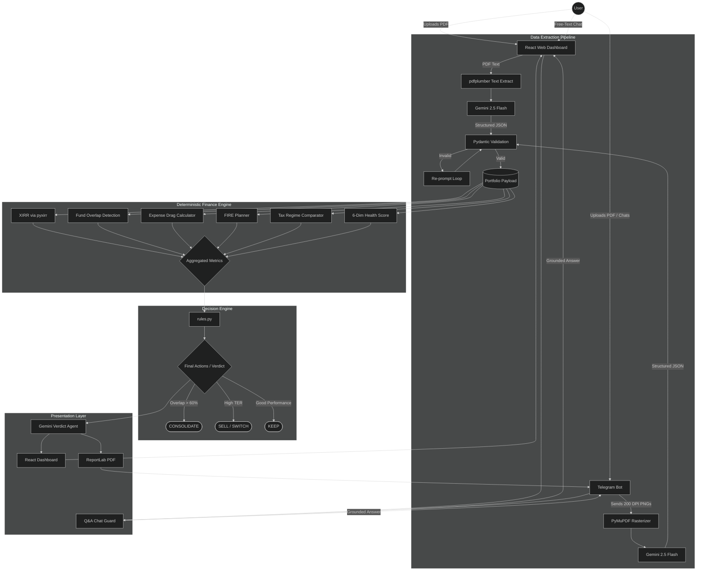

# Complete System Architecture (FinMentor AI & ArthaScan)

> [!IMPORTANT]
> This system is built on **"Zero-Hallucination Finance,"** strictly isolating all mathematical and business logic from the generative AI models to ensure 100% accuracy.

---

## Unified Visual Flow

### Color Guide
- **Purple nodes:** Non-deterministic generative Vision LLMs.
- **Teal nodes:** Pure Python, 100% deterministic algorithms.
- **Red nodes:** Silent fail-safe mechanisms (Regex fallback).
- **Orange nodes:** Final, immutable business logic actions.

---

## 1. Multimodal Data Extraction Pipeline
Standard text-crawlers routinely mangle complex CAMS/KFintech statement tables. Our pipeline avoids this:
*   **Web Dashboard:** `pdfplumber` extracts raw text from CAMS PDFs and optional Form 16 documents, then **Gemini 2.5 Flash** converts it to validated JSON with strict schema prompting.
*   **Telegram Bot:** Rasterizes PDFs to 200 DPI PNGs via `PyMuPDF` for high-accuracy image-to-JSON extraction via Gemini Vision.
*   **Self-Healing Loop:** Pydantic validation with recursive re-prompting on malformed output.
*   **Regex Fallback:** Silent parser as safety net during API timeouts, ensuring data stability.

---

## 2. The "Zero-Hallucination" Math Sandbox
LLMs are permanently banned from performing financial computations. The validated JSON enters a walled-off **Deterministic Financial Engine**:
- **XIRR Engine:** Uses `pyxirr` for exact XNPV/XIRR against historical cashflows — per-fund and portfolio-wide.
- **Overlap Engine:** Pairwise fund overlap detection with interactive Network Graph visualization.
- **Wealth Bleed Calculator:** 10-year expense ratio erosion vs Direct Plan baselines. Real-time ticker.
- **Benchmark Timeline:** Month-by-month portfolio value vs Nifty 50 with identical SIPs.
- **FIRE Planner:** Goal-based SIP allocation with inflation-adjusted corpus projections.
- **Tax Wizard:** Old vs New regime comparison with deduction gap analysis (80C, 80D, 80CCD, HRA).
- **Stress Test:** Scenario-based loss estimation under Nifty corrections with beta-adjusted concentration risk.

---

## 3. Rigid Decision Hierarchy (rules.py)
The math engine passes aggregated financial truths into a hardcoded heuristic tree:
*   If **Overlap > 60%**, triggers `CONSOLIDATE`.
*   If a fund is a **"Closet Indexer"** (high tracking, high fees), triggers `SWITCH`.
*   If performance is optimal, triggers `KEEP`.

The system tells the AI what the math has already decided.

---

## 4. "Glass-Box" Presentation & Chat Guards
LLMs serve strictly as a UI translation layer with an **Intent Router**:
1.  **Math Queries:** Bypass AI entirely, return deterministic answers from the engine.
2.  **Explanation Agent:** Translates deterministic JSON into English/Hinglish without hallucinations.
3.  **Voice AI:** Web Speech API with continuous recognition for hands-free consultation.

---

## 5. Tool Integrations
| Interface     | Tech Stack              | Primary Tools                          |
| :------------ | :---------------------- | :------------------------------------- |
| **Backend**   | FastAPI / Python 3.11   | pyxirr, pdfplumber, google-generativeai |
| **Frontend**  | React 18 / Recharts     | Framer Motion, Web Speech API           |
| **Bot**       | Telegram Bot API        | PyMuPDF, ReportLab, httpx               |

---

## Scalability & Production Note
The architecture is **model-agnostic**. Gemini can be swapped for Claude, GPT-4, or on-premise models (e.g., LLaVA) without altering the core deterministic engines. File-backed sessions upgradeable to Redis/PostgreSQL for production.

View Mermaid Source Code

